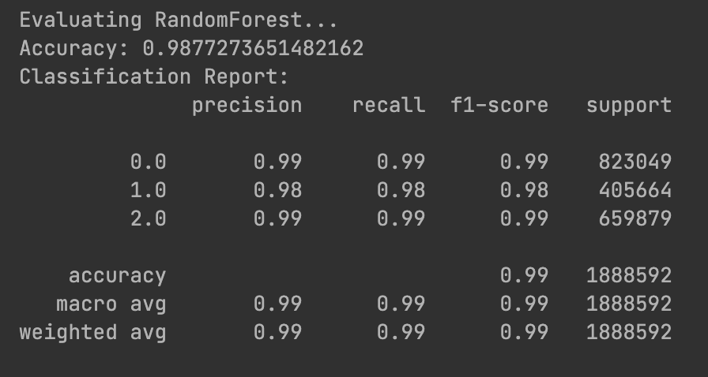
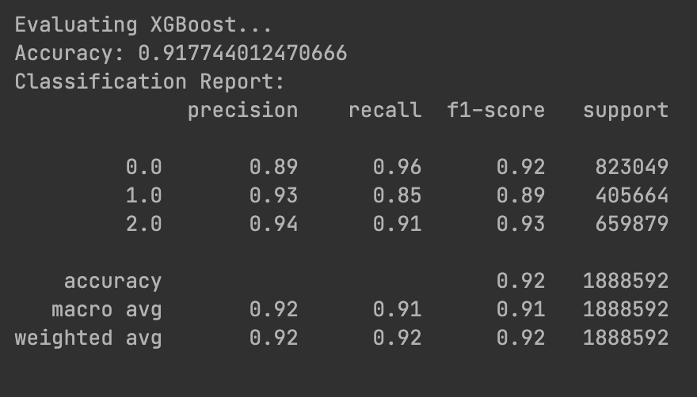
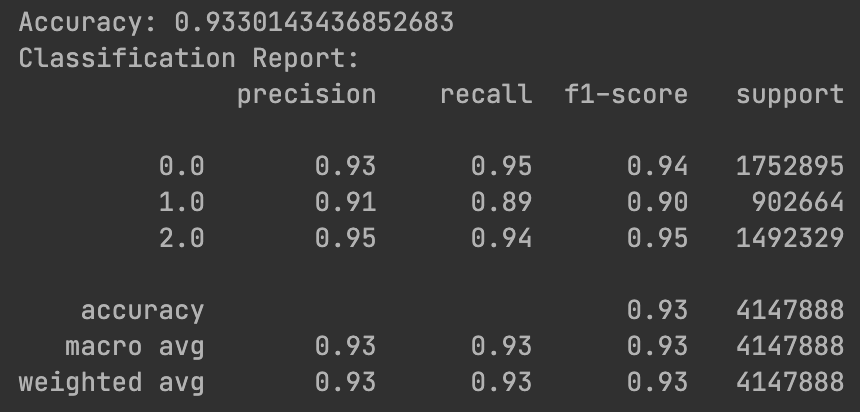

# **Microsoft : Cybersecurity Incident Detection with Machine Learning**

# Machine Learning Cybersecurity Project

## Introduction

In the rapidly evolving cybersecurity landscape, the increasing volume of incidents has overwhelmed Security Operation Centers (SOCs). To address this, there is a pressing need for solutions that can automate or support the remediation process effectively. This project leverages the GUIDE dataset—a groundbreaking collection of real-world cybersecurity incidents—to develop machine learning models for predicting significant cybersecurity incidents and facilitating informed decision-making.

## Problem Statement:
As a data scientist at Microsoft, he/she is tasked with enhancing the efficiency of Security Operation Centers (SOCs) by developing a machine learning model that can accurately predict the triage grade of cybersecurity incidents. Utilizing the comprehensive GUIDE dataset, the goal is to create a classification model that categorizes incidents as true positive (TP), benign positive (BP), or false positive (FP) based on historical evidence and customer responses. The model should be robust enough to support guided response systems in providing SOC analysts with precise, context-rich recommendations, ultimately improving the overall security posture of enterprise environments.

## Business Use Cases:
The solution developed in this project can be implemented in various business scenarios, particularly in the field of cybersecurity. Some potential applications include:

**Security Operation Centers (SOCs)**: Automating the triage process by accurately classifying cybersecurity incidents, thereby allowing SOC analysts to prioritize their efforts and respond to critical threats more efficiently.

**Incident Response Automation**: Enabling guided response systems to automatically suggest appropriate actions for different types of incidents, leading to quicker mitigation of potential threats.

**Threat Intelligence**: Enhancing threat detection capabilities by incorporating historical evidence and customer responses into the triage process, which can lead to more accurate identification of true and false positives.

**Enterprise Security Management**: Improving the overall security posture of enterprise environments by reducing the number of false positives and ensuring that true threats are addressed promptly.

## Dataset Overview

GUIDE_train.csv (2.43 GB)
GUIDE_test.csv (1.09 GB)
[Kaggle Link to Dataset](https://www.kaggle.com/datasets/Microsoft/microsoft-security-incident-prediction)

The GUIDE dataset consists of over 13 million pieces of evidence across three hierarchical levels:

1. **Evidence**: Individual data points supporting an alert (e.g., IP addresses, user details).
2. **Alert**: Aggregated evidences indicating potential security incidents.
3. **Incident**: A comprehensive narrative representing one or more alerts.
4. **Size**: Over 1 million annotated incidents with triage labels, and 26,000 incidents with remediation action labels.
5. **Telemetry**: Data from over 6,100 organizations, including 441 MITRE ATT&CK techniques.
6. **Training/Testing**: The dataset is divided into a training set (70%) and a test set (30%), ensuring stratified representation of triage grades and identifiers.

## Benchmarking

The GUIDE dataset aims to establish standardized benchmarks for guided response systems:

- **Primary Metric**: Macro-F1 score for incident triage predictions.
- **Secondary Metric**: Precision and recall for remediation action predictions.

## Privacy Considerations

To protect sensitive information, the dataset underwent a stringent anonymization process, including:

- **Pseudo-anonymization**: Sensitive values are hashed using SHA1 to maintain uniqueness without revealing identities.
- **Random ID Replacement**: Hashed values are replaced with randomly generated IDs.
- **Temporal Noise**: Timestamps are modified to prevent re-identification.

## Acknowledgements

This dataset is mainly hosted by Microsoft Security AI Research. For more information about GUIDE and its applications, please refer to the related [arXiv paper](https://arxiv.org/abs/2407.09017).

## Microsoft Contacts

For inquiries, please reach out to:

- **Scott Freitas**: [scottfreitas@microsoft.com](mailto:scottfreitas@microsoft.com)
- **Jovan Kalajdjieski**: [jovank@microsoft.com](mailto:jovank@microsoft.com)
- **Amir Gharib**: [agharib@microsoft.com](mailto:agharib@microsoft.com)
- **Rob McCann**: [robmccan@microsoft.com](mailto:robmccan@microsoft.com)


## Tools Used 
**IDE & Notebooks:** PyCharm, Jupyter Notebook

**Programming Language**: Python

**Libraries**: scikit-learn, Pandas, Matplotlib, Seaborn, NumPy

**Cloud Services:** BigQuery, Google Cloud Storage, Google Compute Engine

**Version Control**: Git, Github

## Approach

### Data Exploration and Understanding

**Initial Inspection**: Loaded the `GUIDE_train.csv` dataset and performed an initial inspection to understand the structure of the data, including the number of features, types of variables (categorical, numerical), and the distribution of the target variable (TP, BP, FP).

**Exploratory Data Analysis (EDA)**: Used visualizations and statistical summaries to identify patterns, correlations, and potential anomalies in the data. Paid special attention to class imbalances, which required specific handling strategies later on.

### Data Preprocessing

**Handling Missing Data**: Identified any missing values in the dataset and decided on an appropriate strategy, such as imputation, removing affected rows, or using models that can handle missing data inherently.

**Feature Engineering**: Created new features or modified existing ones to improve model performance. For example, combined related features, derived new features from timestamps (like hour of the day or day of the week), and normalized numerical variables.

**Encoding Categorical Variables**: Converted categorical features into numerical representations using techniques like one-hot encoding, label encoding, or target encoding, depending on the nature of the feature and its relationship with the target variable.

### Data Splitting

**Train-Validation Split**: Before diving into model training, split the `train.csv` data into training and validation sets. This allowed for tuning and evaluating the model before final testing on `test.csv`. A typical 70-30 or 80-20 split was used, varying depending on the dataset's size.

**Stratification**: Used stratified sampling to ensure that both the training and validation sets had similar class distributions, especially since the target variable was imbalanced.

### Model Selection and Training

**Baseline Model**: Started with a simple baseline model, such as logistic regression or decision tree, to establish a performance benchmark. This helped in understanding the complexity needed for the final model.

**Advanced Models**: Experimented with more sophisticated models such as Random Forests, Gradient Boosting Machines (e.g., XGBoost, LightGBM), and Neural Networks. Each model was tuned using techniques like grid search or random search over hyperparameters.

**Cross-Validation**: Implemented cross-validation (e.g., k-fold) to ensure consistent model performance across different data subsets. This reduced the risk of overfitting and provided a reliable estimate of the model's performance.

### Model Evaluation and Tuning

**Performance Metrics**: Evaluated the model using the validation set, focusing on macro-F1 score, precision, and recall. Analyzed these metrics across different classes (TP, BP, FP) to ensure balanced performance.

**Hyperparameter Tuning**: Fine-tuned hyperparameters based on the initial evaluation to optimize model performance. Adjusted learning rates, regularization parameters, tree depths, and the number of estimators, depending on the model type.

**Handling Class Imbalance**: Used techniques such as SMOTE (Synthetic Minority Over-sampling Technique), adjusted class weights, or ensemble methods to improve the model's ability to handle minority classes effectively.

### Model Interpretation

**Feature Importance**: Analyzed feature importance after selecting the best model to understand which features contributed most to the predictions. This was done using methods like SHAP values, permutation importance, or model-specific feature importance measures.

**Error Analysis**: Conducted an error analysis to identify common misclassifications, providing insights for potential improvements, such as additional feature engineering or refining the model's complexity.

### Final Evaluation on Test Set

**Testing**: Once the model was finalized and optimized, it was evaluated on the `test.csv` dataset. Reported the final macro-F1 score, precision, and recall to assess how well the model generalized to unseen data.

**Comparison to Baseline**: Compared performance on the test set to the baseline model and initial validation results to ensure consistency and improvement.

## Link to the Notebook Files

You can view the code and in-depth analysis in the full notebooks:

- Part 1: [here](./MSCyberProj-Part1.ipynb)
- Part 2: [here](./MSCyberProj-Part2.ipynb)

## Utilization of Cloud 

**Google Cloud**: Utilized Google Cloud Storage to store the large dataset.

**BigQuery**: Used to fetch data from Google Cloud Storage into BigQuery, allowing for querying in a Jupyter notebook on a cloud instance.

**Google Compute Engine**: Needed to utilize a Google Cloud Compute instance due to the dataset size.

## Results and Model Performance Analysis

**Training Dataset Performance**: 

Trained using ensemble methods XGBoost and Random Forest; Random Forest performed the best.




**Test Dataset Performance**: 

Selected the Random Forest Classifier and applied it to the test dataset.



**Inferences:**

**High Training Performance**: The model exhibits very high performance on the training dataset, indicating it has learned the patterns in the data well.

**Good Generalization**: The model performs robustly on the test dataset, suggesting it generalizes well to new, unseen data. The slight decrease in accuracy from training to testing is typical and indicates good generalization without significant overfitting.

**Class-wise Variations**: While the model maintains strong performance across most classes, there is a noticeable drop in performance for benign positive incidents in the test set. This could be an area for further investigation and improvement.
Overall, the Random Forest model demonstrates strong capabilities in classifying cybersecurity incidents, with good generalization to real-world data. Future improvements could focus on enhancing performance for specific classes and continuing to monitor and adjust the model as more data becomes available.

## Recommendations

**Integration into SOC Workflows:**

  -**Enhanced Incident Triage:** Integrate the model into SOC workflows to automate and refine the incident triage process, providing SOC analysts with precise classifications of incidents as TP, BP, or FP.
 
  -**Real-time Analysis:** Deploy the model in real-time environments to assist in immediate incident response, helping analysts prioritize and address security threats more effectively.

**Considerations for Deployment:**

  -**Scalability**: Ensure the model can handle large volumes of data in a production environment, potentially leveraging scalable cloud infrastructure.
 
  -**Real-world Testing:** Conduct extensive testing in a real-world setting to validate model performance and address any operational challenges.
  
  -**Feedback Loop:** Implement a feedback loop to capture analyst insights and adjust the model based on real-world usage and performance metrics.

## Citation

Please cite this work as follows:

```bibtex
@article{freitas2024ai,
  title={AI-Driven Guided Response for Security Operation Centers with Microsoft Copilot for Security},
  author={Freitas, Scott and Kalajdjieski, Jovan and Gharib, Amir and McCann, Rob},
  journal={arXiv preprint arXiv:2407.09017},
  year={2024}
}

